class: clear, middle

```{r preamble, child=here::here("Slides", "preamble.Rmd")}
```

# Lecture 22 

- Climate change

- Science overview

- Policy overview

---
## Science overview

CO2 and other GHGs are *fund pollutants*
  - Environment has moderate capacity to absorb
  
  - Alternative is *stock pollutant*: little to no capacity

Accumulation begins past a certain emissions level
  - Atmospheric CO2 accumulation is basically permanent

  - Other chemicals begin to break down over some time frame

---
## Emissions

Emissions are often measured in terms of CO2 equivalence

  - Carbon, CO2 and GHGs are often used interchangeably in this context

Global Warming Potential (GWP)

  - How much a chemical contributes to warming, relative to CO2

  - CO2 is 81% of the concentration, not the mass

.center[
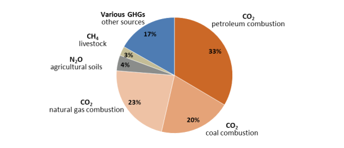
]


---
### $CO_2$ Emissions


Since 1980, humans have released more than half of all emitted $CO_2$.

```{r co2_by_country, echo=FALSE, out.width="50%", fig.align='center'}
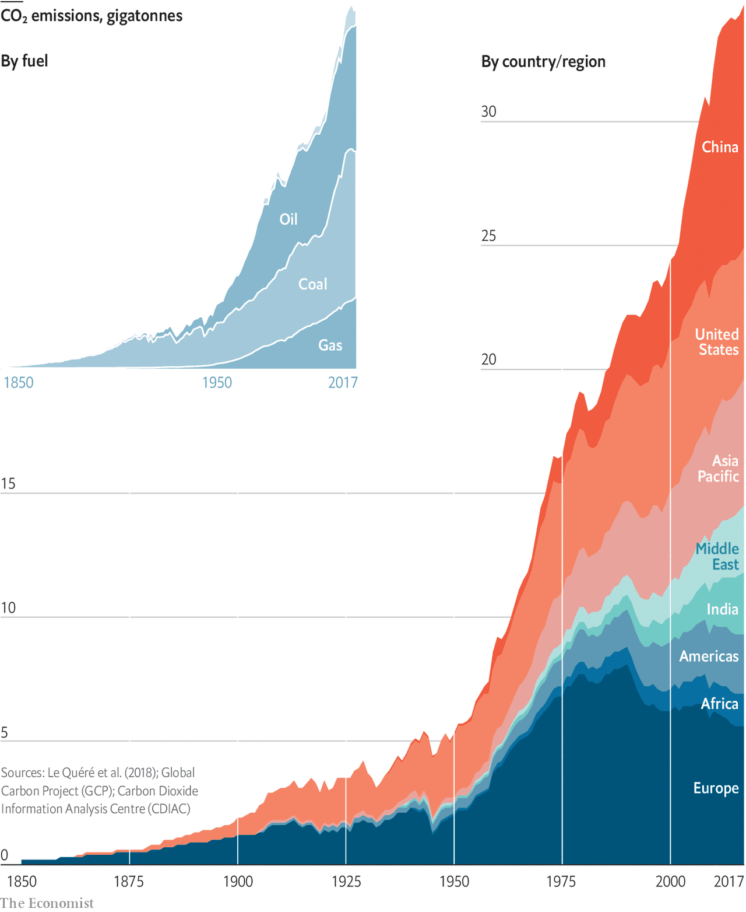
```


---
## Consensus is easy to misrepresent

.pull-left[
Multiple sources of uncertainty in temperature models:

*Human-driven uncertainty*
  - How much do humans continue to emit?

*Statistical uncertainty*
  - Yearly emissions $\to$ concentrations

  - Concentrations $\to$ temperature changes

  - Temperature changes $\to$ outcomes
]
.pull-right[


*In this figure, identify the two sources of uncertainty*
]

---
### Local vs non-local pollutants

Local pollutants are simpler to regulate because the damages are contained within roughly the same region they come from
  - SO2, particulate matter, ground-level ozone, etc.

Non-local pollutants, including all important greenhouse gases (GHGs), are more challenging to regulate
  - Prisoner’s dilemma with billions of players

  - Even for big economies, most of the outcome is determined by actions of others

---
### Strategy overview

*Plan A: Mitigation*
  - Prevent emissions from reaching the atmosphere

  - Increase efficiency, reduce polluting activities, carbon capture and storage

*Plan B: Adaptation*
  - Reduce damages from climate change
  - Infrastructure improvement, long-term planning, agriculture technology

*Plan C: Geoengineering*
  - Directly counteract some effects of climate change, particularly temperature
  - Emit particles that reflect solar radiation


---
## Paris Agreement
From the UN Framework Convention on Climate Change (UNFCCC)

Overall goal is to keep global temperature increases below 2 degrees Celsius (relative to pre-industrial averages)

US goal by 2025: reduce emissions by 26-28% below 2005 levels


---
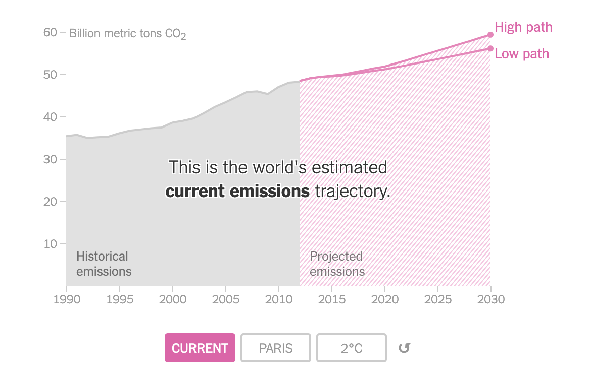


---
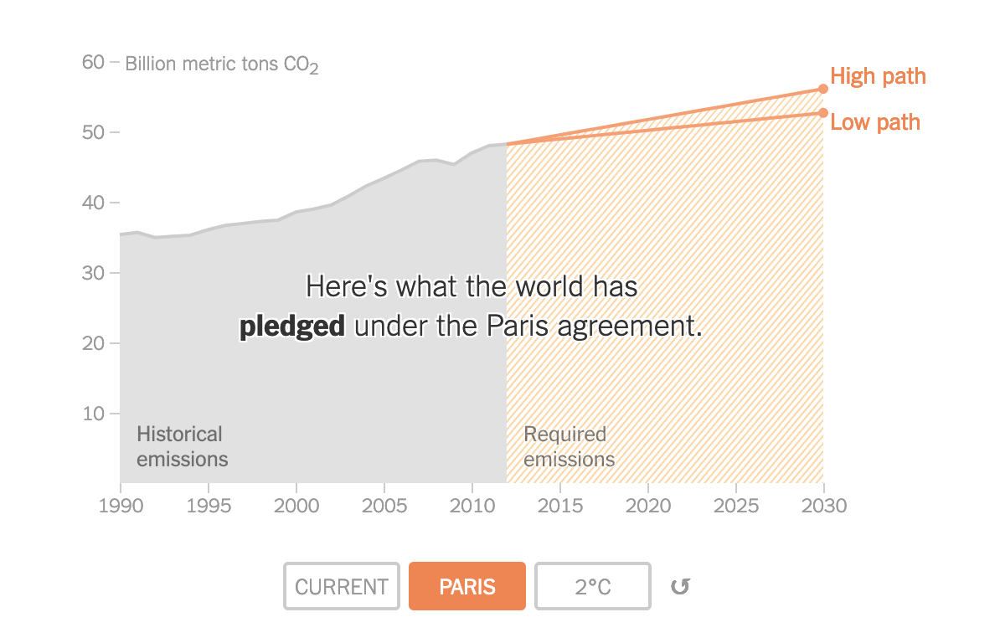


---
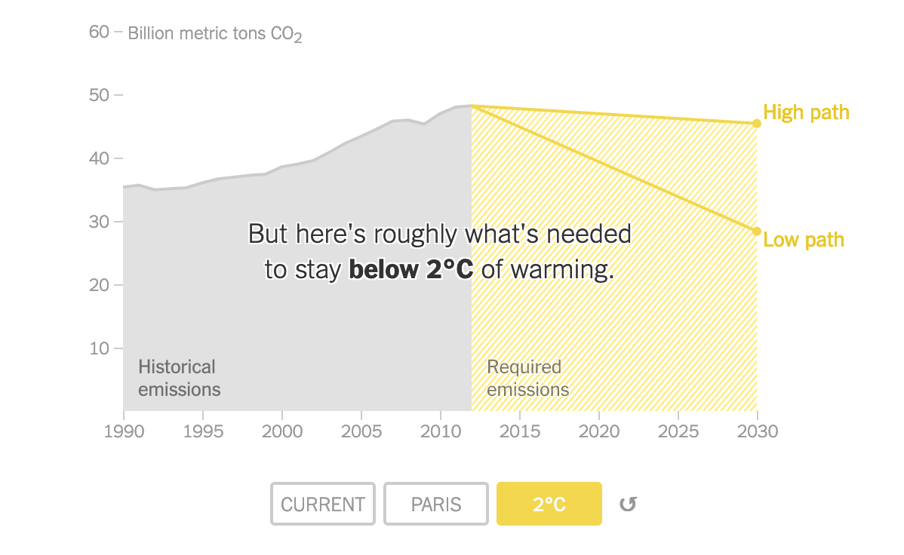


---
### Why 2 degrees?

Various sources of damages respond to temperature increases differently

Lower is better, but things start getting bad around 2

<br>

Although there is no "cliff", things get worse an often at an exponential fashion:

- [The Uninhabitable Earth](../Articles/The Uninhabitable Earth.pdf) ([online version](https://nymag.com/intelligencer/2017/07/climate-change-earth-too-hot-for-humans.html)).

- [Why Half a Degree Matters (1.5 to 2)](https://www.nytimes.com/interactive/2018/10/07/climate/ipcc-report-half-degree.html)


---
### Cost of climate change
Net present value of damages
  - What society should be willing to pay now

Discount rate matters
  - Small $r$ $\implies$ immediate action
  - Large $r$ $\implies$ we can wait longer

Average social cost of carbon (per ton) estimate
  - $r=.05 \implies \$11$
  
  - $r=.03 \implies \$36$
  
  - $r=.025 \implies \$56$
  
**Biden just set it to $51!**

---
class: center, middle

#### Economic Costs in the US

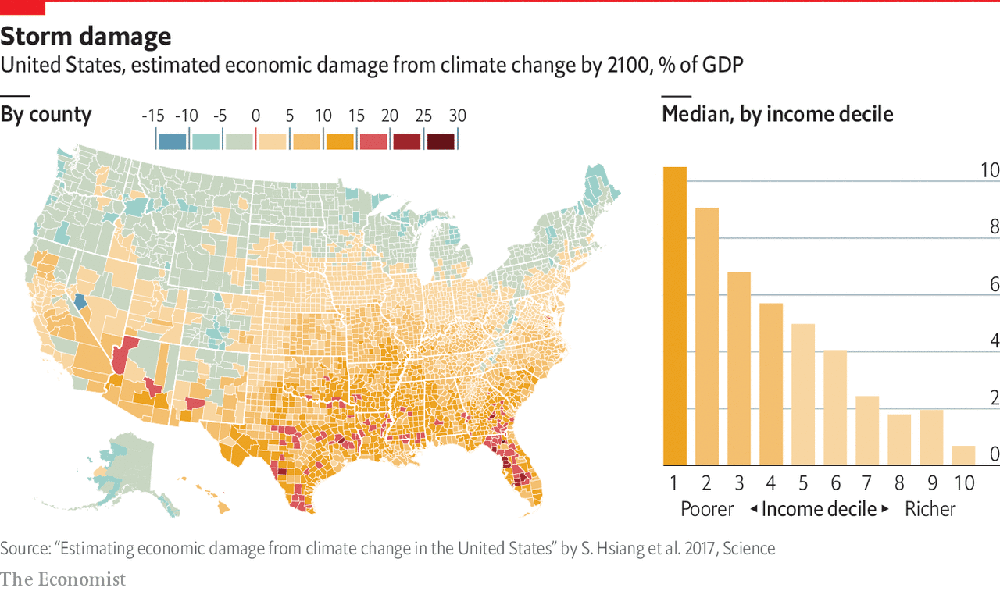

[Source](https://www.economist.com/graphic-detail/2019/03/05/climate-change-will-affect-more-than-the-weather)


---
## Reading for next time

[The Uninhabitable Earth](../Articles/The Uninhabitable Earth.pdf) ([online version](https://nymag.com/intelligencer/2017/07/climate-change-earth-too-hot-for-humans.html)).

[Why Half a Degree Matters (1.5 to 2)](https://www.nytimes.com/interactive/2018/10/07/climate/ipcc-report-half-degree.html)


---
class: clear, middle
# Lecture 23

- Policies for local air pollution

- US Acid Rain Program

- Programs in France, Sweden, Japan


---
## Acid Rain Program

Targeted coal-burning power plants to reduce atmospheric SO2 and NOx
  - Major causes of acid rain

  - Acid rain harms forest health, certain animal species, and degrades infrastructure

Market-based policy from the US Clean Air Act of 1990
  - Goal was to lower annual SO2 emissions from 18.9 million tons $\to$ 8.95 million tons
  - Less than half of 1980 emissions level
  
---
## Acid Rain Program
.subtitle.alice[as explained by Hank Green]

.center[
<iframe width="560" height="315" src="https://www.youtube.com/embed/oqJO8HwxTkg" frameborder="0" allow="accelerometer; autoplay; clipboard-write; encrypted-media; gyroscope; picture-in-picture" allowfullscreen></iframe>
]


---
## Acid Rain Program
Phase 1 (1995): 110 of the largest plants forced to reduce SO2 emission rates to 2.5 lbs/mmBtu
  - Pounds per million British thermal units (measure of fuel inputs)

  - 1 Btu = amount of heat required to raise one pound of water by 1 degree F

If plants end up with excess permits
  - Use them on another plant they own, sell to a different plant, or keep for future

  - Permits and pollution are counted at the end of each year

  - In effect, firms were given permits for 2.5 lbs/mmBtu; 

  - Firms that pollute more got more permits because it is a rate, not a sum total

  - Initial permit allocation was relatively friendly towards the biggest polluters

---
## Acid Rain Program

Phase 2 (2000): target rate was lowered to 1.2 lbs/mmBtu, and expanded to include many more plants

  - Plants still allowed to trade allowances

  - Fine of $2,000 per ton of SO2 for pollution over the permitted amount

Allowance Auction Reserve

  - What happens if nobody is willing to sell at the end of the year?

  - EPA withholds 2.8% of total permits to be auctioned

---
class: center, middle

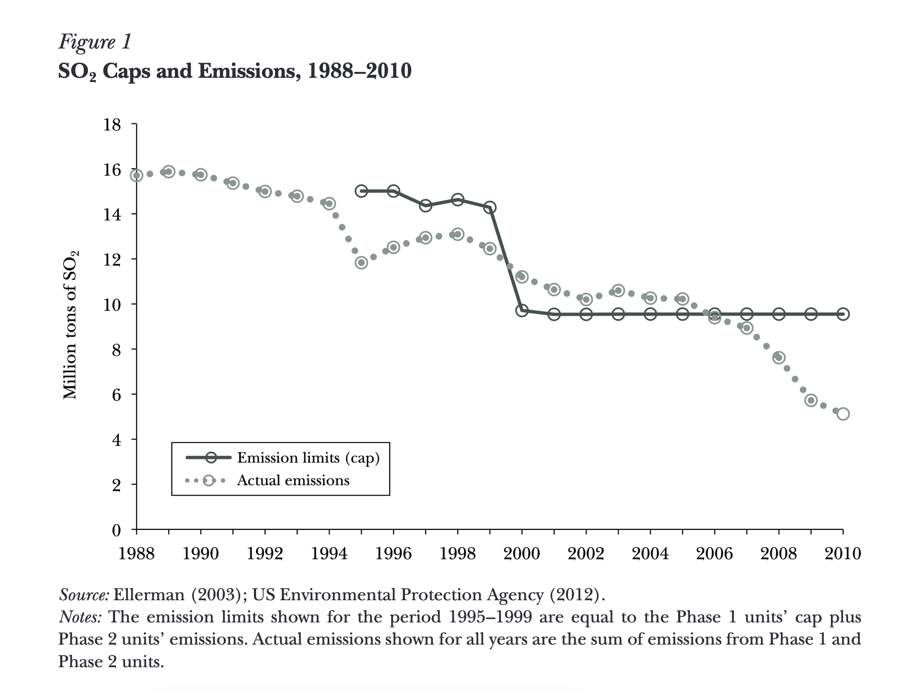

[Source](http://pubs.aeaweb.org/doi/pdfplus/10.1257/jep.27.1.103)


---
### Acid Rain Program conclusions

Extremely successful and efficient
  - Really big influence on environmental policy

Cost of compliance was lower than expected because of railroad deregulation
  - Low-sulfur coal from Powder River Basin

Benefits were much greater than expected
  - Accidentally fixed a problem even more costly than acid rain 

  - PM2.5 (fine particulate matter) has important human health impacts

  - [The SO2 Allowance Trading System: The Ironic History of a Grand Policy Experiment](http://pubs.aeaweb.org/doi/pdfplus/10.1257/jep.27.1.103)


---
## France - emissions tax

Per-unit emissions tax on all "large" polluting sources 
  
  - Starting at 23 euros/ton, applicable for SO2, NOx, and HCl

  - Lots of exceptions

90% of revenue $\to$ subsidy for pollution control equipment

10% of revenue $\to$ public research

In retrospect, tax level was too low to be effective
  - Pollution removed from cheapest sources first, but not much
  
  - Incentive to decrease emissions was too low


---
## Sweden - NOx tax with rebate

Emissions tax on nitrogen oxide emissions

Polluting firms often find it rational to invest in lobbying against environmental taxes

  - Compromise: tax emissions, give tax revenue back to firms as a rebate

  - If the rebate is proportional to how much tax was paid, this reduces the incentive to abate emissions

Swedish solution: tax based on emissions, rebate based on energy production
  - Good: greatly encourages energy efficiency
  
  - Bad: no incentive to reduce energy consumption

  - Overall, benefits were found to outweigh the costs 3 to 1


---
## Japan - health impact tax

1973: Law for the Compensation of Pollution-Related Health Injury

Compensation: based on medical expenses and lost earnings

  - Must have a disease from the list, or else general respiratory problems

  - Polluting firms taxed proportionally to estimated damages from emissions; vehicles taxed by weight

Interesting approach to "social cost of pollution"

  - Unintended consequences

  - Greater population density + lower emissions base $\to$ very high per-unit charges

---
## Video for Next Time

[A Brief History of Environmental Justice](https://www.youtube.com/watch?v=30xLg2HHg8Q)

Example: Cancer Alley - [Why This Town is Dying From Cancer](https://www.youtube.com/watch?v=ZB8CbDG7gpk)


---
class: clear, middle
# Lecture 24

  - International air pollution policies

---
## Ozone layer

Ozone depletion is related to climate change, but it is not a major cause

We primarily care about the ozone layer for human health reasons
  - Prevents UV radiation- cancer risk

Ozone depleting substances (ODS’s)
  - Refrigerants, solvents, propellants, chlorofluorocarbons (CFC’s)

---
### Montreal Protocol (1988)

International agreement to phase out the damaging chemicals
  - First universally ratified treaty in history of the UN

Command and control policy, but aimed to mimic market outcomes
  - Chemicals with good alternatives or high costs were phased out more quickly

  - Slower phase-out for others

Some "essential use" chemicals got exceptions
  - Asthma inhalers, submarine/aircraft fire extinguishers

Multilateral Fund
  - UN: countries have a common but differentiated responsibility to protect and manage the global commons.
  
  - Provides support for developing countries to more easily comply with Montreal

---
### Montreal Protocol effects

As of 2008, 95% of ODC’s have been phased out of the market

Ozone layer is projected to return to normal by 2050-2070

> "…perhaps the single most successful international agreement to date has been the Montreal Protocol"
> 
> Kofi Annan (2003)

Note: HCFCs are less important for ozone, but more important for climate change


---
### Failed Climate Change Agreement

.pull-left[
```{r losing-earth, echo=FALSE, out.width="80%", fig.align='center'}
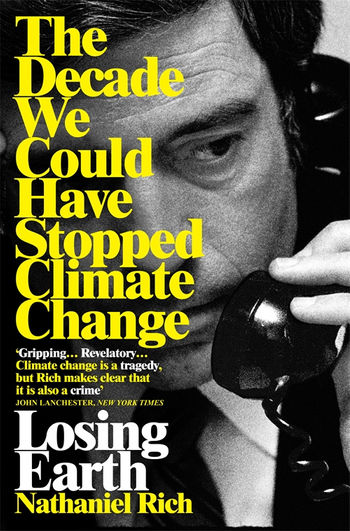
```

]
.pull-right[
- Starting in 1970s, there were large congressional hearings headed by Al Gore.

- UN put out reports similar in concensus as the IPCC reports are today

- By 1989, had a **binding** agreement ready to be signed, but the US decided against signing it at the last minute
]


---
### Early climate negotiations

Europe wanted carbon taxes, US wanted cap and trade

Issues with a tax
  - Want to keep revenue in the country it came from
  
  - Financial burden on firms

  - Not every country is taxed $\to$ leakage

Kyoto Protocol eventually adopted cap and trade, but the US failed to ratify
  - Did not get through Congress under Clinton, later withdrawn by G.W. Bush

---
### Kyoto Protocol
1992: UN Framework Convention on Climate Change (UNFCCC)
  - Endorsed market-based mechanisms as the primary method for dealing with climate change

1997: Kyoto Protocol was signed by 82 countries (now 192)
  - By 2008-2012, countries must reduce emissions to 5% below 1990 levels

  - Targeted a GWP-weighted average of CO2 and the other major GHGs 

  - Flexible ways to meet this standard using market-based mechanisms

---
### Kyoto Protocol- three mechanisms

*Emissions trading*

- Classic cap and trade mechanism with countries as the market participants

- Buy and sell AAUs (Assigned Allowance Units, basically permits) with other countries 

*Joint Implementation*

- Countries receive ERUs (Emission Reduction Unit) for financing projects that reduce emissions in another participating country

*Clean Development Mechanism*

- Receive CERs (Certified Emission Reduction) 

- Similar to above, but targets non-participating, developing countries


---
### EU ETS
Kyoto requires participating countries to meet a standard or else pay other countries to exceed the standard
  - Countries get to decide how to reduce their own emissions

  - Can use any policy or set of policies they want

Large group of European countries got together and formed the Emissions Trading System (EU ETS)
  - Work together rather than separately

More on this policy later

---
#### Theoretical cost of Kyoto

With universal compliance, the cost of stabilizing concentrations at 350-550 ppm is fairly small
  - [Azar and Schneider (2002)](http://stephenschneider.stanford.edu/Publications/PDF_Papers/EconomicCostsOfStabilizingClimate.pdf)

1-3 year delay in reaching the global GDP that would have otherwise happened
  - BAU - business as usual, no big climate policy
  
```{r kyoto-costs, echo=FALSE, out.width="70%", fig.align='center'}
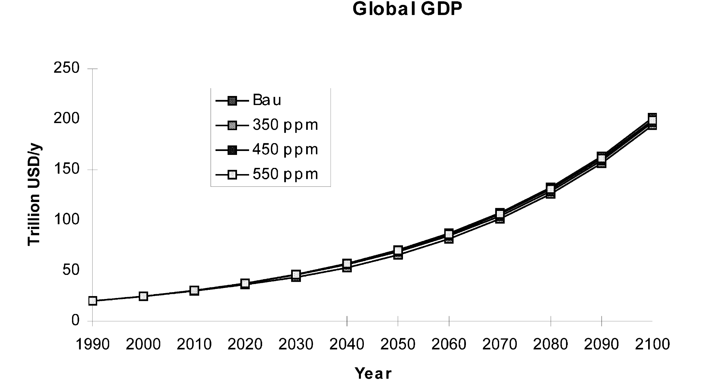
```


---
#### A tale of two graphs
.pull-left[
Per Capita emissions

<br>

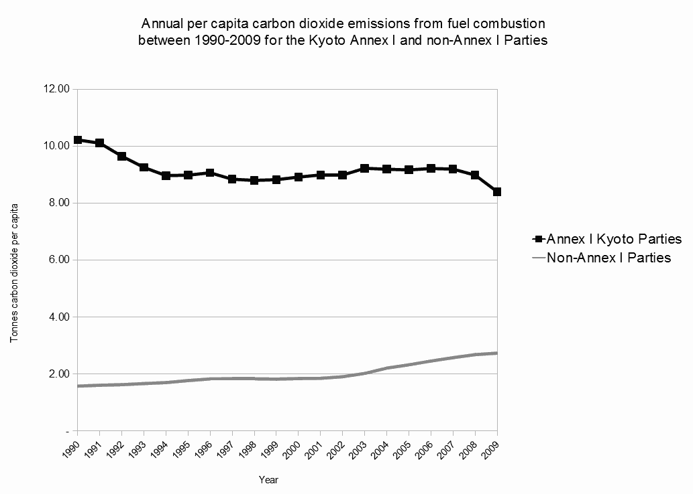
]
.pull-right[
Total emissions

<br> 

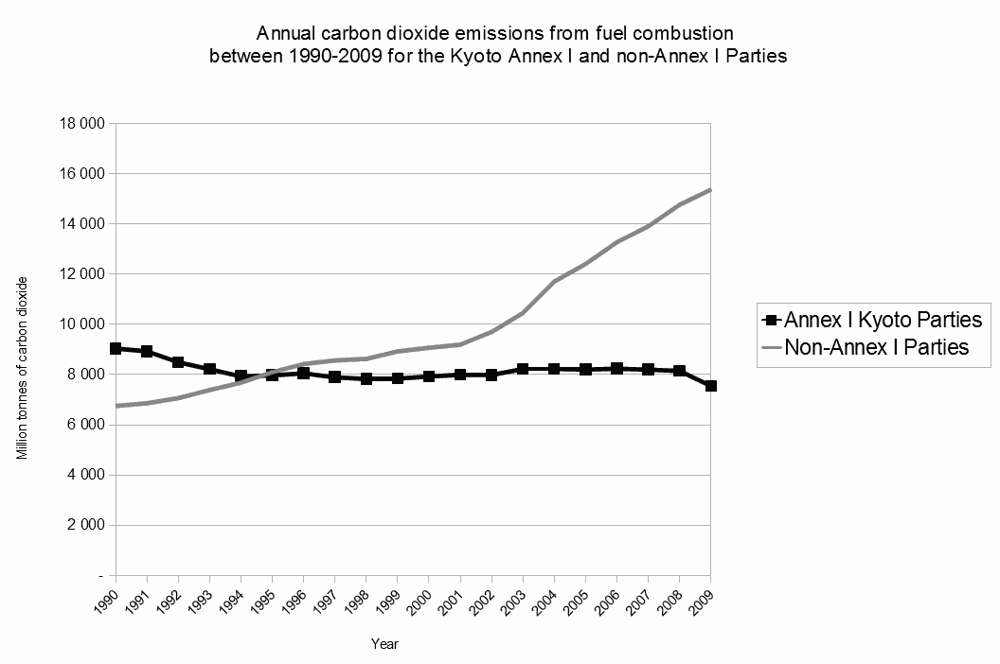
]


---
#### Kyoto Protocol conclusions
Goal was 5% reduction in GHG emissions compared to 1990
  - We got a 58% increase - whoops

Large developing countries were not required to participate
  - Main reason the US didn’t ratify Kyoto

  - Underestimated how fast these countries would grow, population and economies

  - Economies of China, India, and Brazil grew 550% from 1997-2012

Russia’s economic recession led to accidental compliance and lots of extra permits


---
## Reading for Next Time

  - [Most countries aren't hitting 2030 climate goals, and everyone will pay the price](../Articles/Most countries arent hitting 2030 climate goals, and everyone will pay the price.pdf) ([online version](https://www.nationalgeographic.com/science/2019/11/nations-miss-paris-targets-climate-driven-weather-events-cost-billions/)).

  - [China’s Pledge to Be Carbon Neutral by 2060 - What It Means](../Articles/Chinas Pledge to Be Carbon Neutral by 2060- What It Means - The New York Times.pdf) ([online version](https://www.nytimes.com/2020/09/23/world/asia/china-climate-change.html)).

  - [John Kerry, Biden’s Climate Czar, Talks About Saving the Planet](../Articles/John Kerry, Bidens Climate Czar, Talks About Saving the Planet — ProPublica.pdf) ([online version](https://www.propublica.org/article/john-kerry-biden-climate-czar)).


---
class: clear, middle
# Lecture 25

  - Paris Agreement

  - Country-specific climate change policies

---
### Biggest GHGs producers

LUCF: land use change and forestry
  - Indonesia didn’t directly produce a large amount of GHGs

  - However, deforestation more than doubled their effective impact


```{r co2-emissions-top10, echo=FALSE, out.width="70%", fig.align='center'}
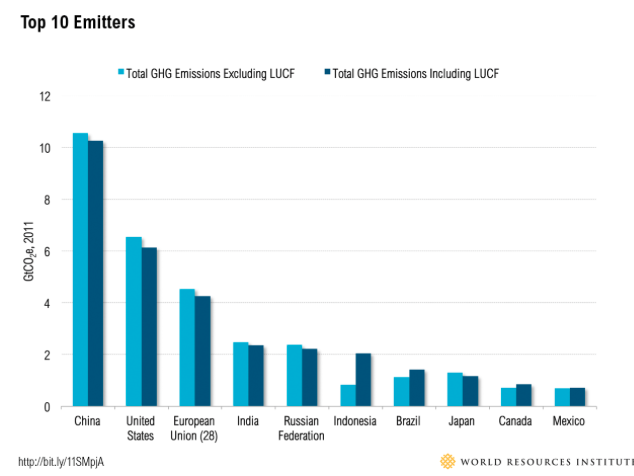
```


---
### Cumulative emissions
Current emissions don’t tell the whole story when it comes to assigning blame

Recall that atmospheric carbon concentrations take a very long time to decay

The plurality of current concentration comes from the US

<br>

```{r co2-emissions-by-country, echo=FALSE, out.width="70%", fig.align='center'}
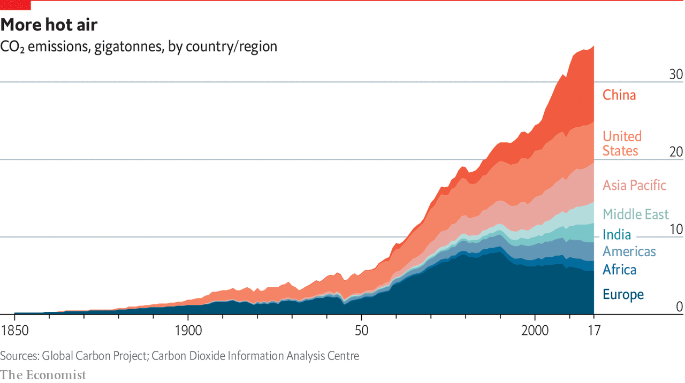
```


---
#### Per-capita emissions

Developed countries produce more emissions per capita, even though they tend to be less industrialized

  - We drive more cars, fly more planes, use more energy

<br> 

```{r co2-emissions-per-captia, echo=FALSE, out.width="70%", fig.align='center'}
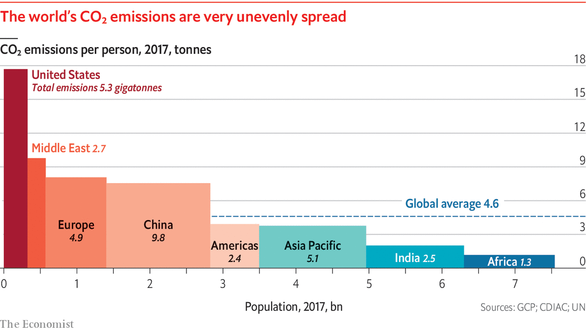
```


---
class: center, middle

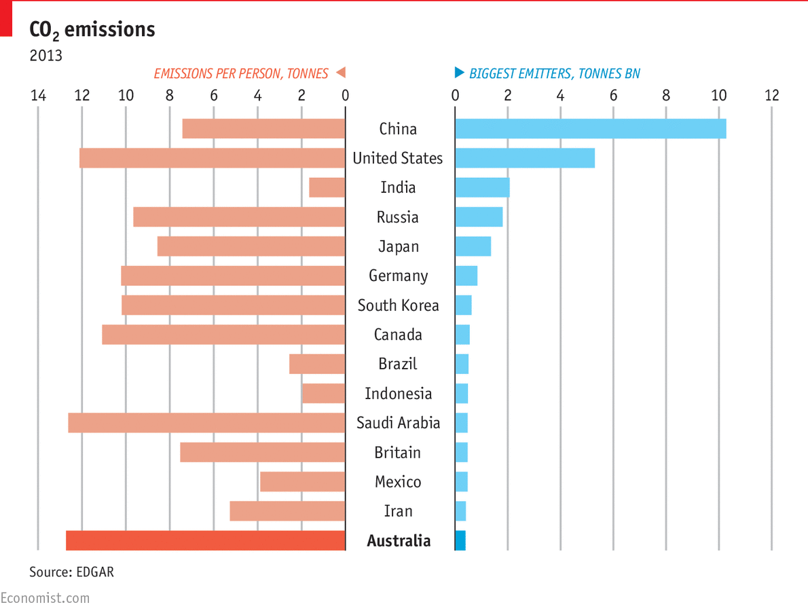

---
## Paris Agreement

Because the Kyoto Protocol ended in 2012, the UN met again in 2015 to establish new rules

Big change - Nationally Defined Contributions
  - Countries present their own targets

  - Targets must be more ambitious over time

Overall goal is to keep temperature from rising 2C above pre-industrial averages

  - Adding up the stated commitments, we get a temperature increase of closer to 3C

  - Prisoner’s dilemma again
  
  
---


---


---


---
## Paris Agreement

Differences from Kyoto

  - Paris is more flexible, more universal, more ambitious, but less enforceable

Agreement is not directly enforceable by international laws

  - "Name and shame" method

How much does climate matter to countries, relative to other issues?
  
  - Trade, human rights, military cooperation


---
### US withdrawal

US formally withdrew on November 4, 2020

- Likely that Joe Biden reenters us into the agreement.

- John Kerry was announced as the climate czar and was one of the negotiators for the Paris Climate Accord, so...

[More Details here](https://www.bbc.com/news/science-environment-54797743)

[Climate Czar John Kerry](https://www.propublica.org/article/john-kerry-biden-climate-czar)


---
### Effects

Political Standing (repeated game)
.center[
<iframe width="560" height="315" src="https://www.youtube.com/embed/0RaunX9LrC4" frameborder="0" allow="accelerometer; autoplay; clipboard-write; encrypted-media; gyroscope; picture-in-picture" allowfullscreen></iframe>
]

Race to the bottom issues: German automakers worry about competitiveness


---
## China’s carbon market
Large-scale cap and trade system started in December 2017

  - Affects firms in the electricity, metals, chemical, building materials, paper industries 

  - China already has some cap and trade experience with local pollutants

Existing regional pilot programs highlight the practical challenges

  - Transparency: programs are ineffective if emissions and permits are not accurately reported to outsiders

  Ex: if 10% of firms manipulate emissions data, permit prices fall for the rest $\to$ lower incentive to abate emissions for the other 90%

Push towards renewable energy at the same time


---
## China's carbon market

```{r china-carbon-market-2, echo=FALSE, out.width="70%", fig.align='center'}
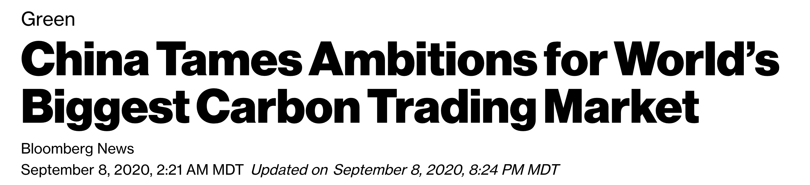
```

Will limits be tightened in the future?

<br>

```{r china-carbon-market-1, echo=FALSE, out.width="70%", fig.align='center'}
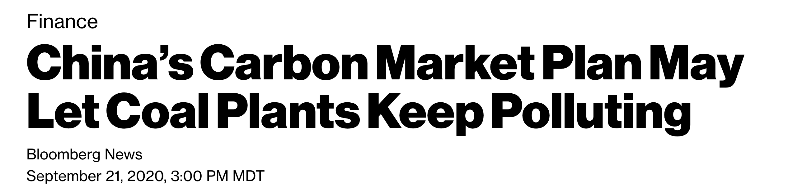
```


---
## European Union Emissions Trading Scheme (EU ETS)

Largest cap and trade system in the world
  - Covers about 40% of anthropogenic GHG emissions from the EU

Operates in different "trading periods"
  - 2005-2007, 2008-2012, 2013-2020
  
Phase 3 (most recent) changes

  - More chemicals are covered (including NOx and perfluorocarbons)

  - Includes the airline industry

  - Most permits are auctioned rather than distributed freely

---
### EU ETS
Global economic recession lead to permit surpluses
  - Quantity of permits ended up not being ambitious

European Commission had two unfortunate choices
  1. Continue on as planned $\to$ low permit prices and low incentive to improve long-run emissions efficiency
  
  2. Restrict permit auctions in order to re-determine quantity where MSC=MSB $\to$ policy uncertainty (firms don't like uncertainty)

Decided to go with option 2, created Market Stability Reserve
  - Commitment to inflexible policy leads to better investment incentives

  - Going forward, firms know that they cannot count on the EU ETS to stay the same

---
## United States
Kyoto Protocol was not binding for the US
  - Clinton signed it, Senate unanimously voted against ratifying it, neither Bush nor Obama proposed it to Congress for ratification

2009: Waxman-Markey bill passed Congress but failed in Senate 

  - Cap-and-trade bill based on EU ETS

  - Would have aimed for 17% emissions reduction by 2020 (relative to 2005)

Controversial part - renewable portfolio standard
  - Required 20% of generation from renewables for most utilities

---
## United States
October 2015: Obama and the EPA proposed the Clean Power Plan 
  - EPA administrative action, not legislation

Individual states must meet state-specific emissions standards

  - States can choose specific policy instruments, or EPA can choose for them

  - There is also a provision for multi-state trading markets

State plans must have three broad guidelines
  - Increase efficiency of existing plants

  - Switch from coal to natural gas

  - Switch from fossil fuels in general to renewables in general

---
### Clean Power Plan implementation

Clean Air Act (1990) says EPA must regulate things that "cause or contribute to air pollution which may reasonably be anticipated to endanger public health or welfare"
  - Argument for GHG regulation is based on EPA’s Endangerment Finding (2009)

February 2016: Supreme Court halted enforcement until all of the constitutionality lawsuits cleared up
  - Utilities, coal companies, and 27 states 

  - Argument 1: Unconstitutional because it violates states rights
  
  - Argument 2: Endangerment Finding doesn’t apply this way
  
---
### Clean Power Plan implementation
  
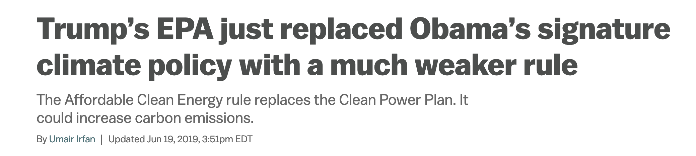

What will Biden do?


---
## Reading for Next Time

  - [Tracking Climate Action Under the Biden Administration: Where Has Progress Been Made?](../Articles/What is the Biden Administration Doing to Fight Climate Change? | World Resources Institute.pdf) ([online version](https://www.wri.org/insights/biden-administration-tracking-climate-action-progress)).


---
class: clear, middle
# Lecture 26

  - Environmental taxes

  - Double dividend hypothesis


---
### Recap
Taxes alter the behavior of people in markets
  - Raise costs (tax on supply) or lower benefits (tax on demand)

"Social Marginal Benefit" and "Social Marginal Cost" curves
  - Equal to the demand (or supply) curve plus externalities

Pigou argued that we can fix externalities by imposing taxes or subsidies
  - Shift the private curve so that market participants pick the optimal Q

  - Optimal Q is where social marginal cost = social marginal benefit

---
### Taxes
Most taxes are not Pigouvian
  - Do not aim to correct an externality

Most taxes disincentivize market activity that would create economic surplus

Big example: labor market and income taxes
  - Employers buy labor hours, and workers sell labor hours

  - Income taxes reduce the supply of labor

How much more would you work if you didn’t have to pay taxes on your income?

---
### Distortionary taxes
When a market does not have an externality, the private supply and demand curves are the same as their social counterparts

  - Ex: Social cost of me teaching this class = (cost to me) + (zero)*(7.6 billion)

  - This is the same as my private supply curve

Taxes on these markets are "distortionary"
  - Increases government revenue, but decreases market surplus even more

Lost surplus minus government revenue = "deadweight loss"

---
### What can we do with revenue?

Option 1: Pay off debts faster
  - Interest rates on government debt are very low these days, so this is low value

  - T-bill interest rate is ~2.0%, TIPS is ~0.7%

Option 2: Spend it on things
  - Provision of public goods can be very high value (roads, basic research, law enforcement)

  - Sometimes very low value (pick your favorite example of waste or corruption)

Option 3: Use it to reduce other taxes


---
### Double dividend hypothesis
  
Revenue-neutral environmental taxes can provide two separate benefits (dividends) 
  - Gordon Tullock (1967)

  - "Revenue neutral" means that the government income is offset somehow

1) Reduction in a negative externality in the same market
  - Ex. Gasoline tax $\to$ lower gasoline consumption $\to$ lower emissions

2) Lower distortionary effects of another tax in a different market
  - Ex. Lower sales taxes $\to$ people can buy more $\to$ more economic surplus

---
### Double dividend hypothesis
How much economic value is created by removing $1 of tax?

  - Depends on which tax we are able to reduce

  - Common range of estimates is $1.20 to $1.50

Externality taxes can be a big win-win for society
  - Improve the environment

  - Reduce bad incentives in other markets

---
### British Columbia carbon tax
2008: $10/ton carbon tax, collected "at the pump"
  - Increases to $30/ton by 2012

Tax revenue increases $\to$ corporate and income taxes are reduced

  - Formula ensures that it is revenue neutral

Fossil fuel consumption fell by 18.8% relative to the rest of Canada
  - Economy grew at the same rate

  - Considered to be very successful in reducing emissions efficiently

  - Unpopular?


---
### Other considerations
Distributional consequences are always relevant
  - Increase in economic surplus may create winners and losers

  - Some taxes are regressive, some are progressive

Some environmental taxes fail because there is no consensus on how to spend the money
  - [Washington votes no on a carbon tax — again](https://www.vox.com/energy-and-environment/2018/9/28/17899804/washington-1631-results-carbon-fee-green-new-deal) and [A Carbon Tax in Washington State Seemed Like a Sure Thing. What Went Wrong?](https://www.motherjones.com/environment/2019/01/a-carbon-tax-in-washington-state-seemed-like-a-sure-thing-what-went-wrong/)
  

---
# Midterm 2

No math, no calculators

Multiple choice and short answer questions

You may use a notecard-sized cheat sheet again
