class: clear, middle

```{r preamble, child=here::here("Slides", "preamble.Rmd")}
```


## Reading for This Lecture

- Chapter 3, pages 46-63


---
class: clear, middle
# Lecture 27

  - Valuation overview

  - Cost/benefit analysis

  - Efficiency

---
## Valuation overview
Natural resources are special because they are valuable, but they originate without ownership

Most goods are allocated by markets
  - Willingness to pay and willingness to accept manifest through prices

Government, as the representative of collective interest, sets the rules by which natural resources are allocated for use or preservation

When goods are valuable but not privately owned, we need a non-market definition of value

---
### Valuation- why?

Most of the effort we put into valuation is intended to inform policy decisions
  - Otherwise it’s just "this will create jobs" vs "this will destroy the environment"

Goal of environmental economics is to introduce some cold objectivity into otherwise emotional policy debates

All valuation methods are inherently limited by uncertainty

Hopefully nobody tries to pass off a valuation result as definitive fact
  - For important decisions, we should use many different approaches


---
### Policy analysis
Positive vs normative analysis
  - *Positive*: measures objective effects of a policy action
  
  - *Normative*: evaluates policy along inherently subjective criteria

Normative analysis is essential for decision making
Broadly speaking, there are two different scenarios where we do normative policy analysis

1. Decide if a pre-defined project is "worth it"

2. Find the optimal policy among all possible choices


---
### Cost-benefit analysis
CBA is a common approach for situations where the policy action is well-defined; do the benefits outweigh the costs?
  - If TB > TC, we do the project 

Even though this may seem objective, it still uses subjective assumptions

 - Do we value benefits equally for all people? (Old vs young, rich vs poor, EJ issues, etc.)

Costs are usually easier to measure than benefits 
  - More on this later


---

```{r book-table-3-3, echo=FALSE, out.width="50%", fig.align='center'}
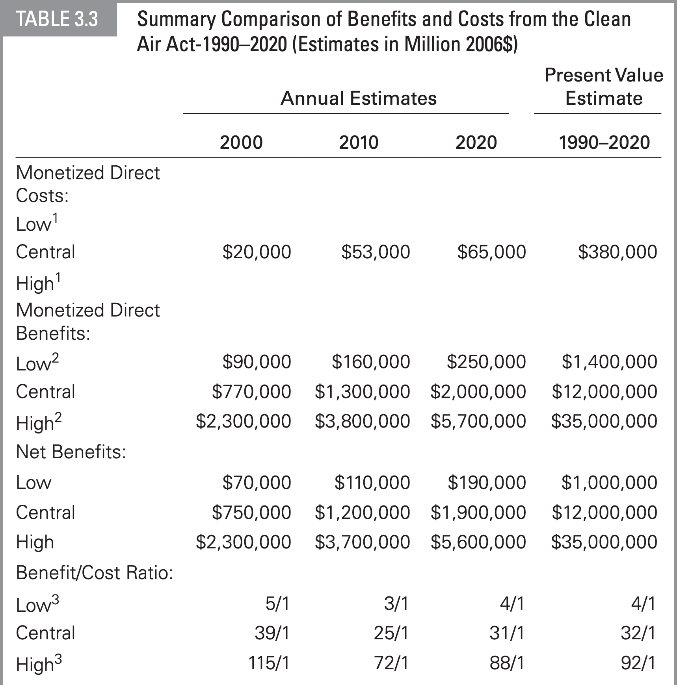
```


---
### Pareto optimality
An allocation is "Pareto optimal" if you can’t help anyone without hurting someone else

  - I get a dollar, you get a dollar, we throw a third dollar away- not Pareto optimal

  - I get a dollar, you get two dollars- Pareto optimal

This concept is helpful for getting to efficiency because it removes unjustifiable allocations

Corollary: Any Pareto optimal allocation is theoretically justifiable according to some set of subjective values (or a social welfare function)


---
### First Equimarginal Principle

*First Equimarginal Principle*

  - Social net benefits are maximized when the social marginal benefits from an allocation equal the social marginal cost

Translation: When a decision can be described along a single axis (i.e. how many dollars should be spent), keep increasing until the next unit costs more than it creates in benefit

Same idea as in markets with externalities

  - Socially optimal Q is where $SMC = SMB$


---
### CBA limitations

Study based on Army Corps of Engineers water projects

  - About half of the projects had costs estimates that were off by 20+% 

  - Sometimes the decision looks wrong in hindsight

Who gets the benefits and who gets the costs?

  - CBA is solid if we only care about total amounts

"Social welfare functions" adjust for distribution of outcomes

  - Basically, weight outcomes differently across different groups

  - 10 people get $1 vs. 1 person gets $10; need not be equally desirable outcomes


---
### Cost-effectiveness analysis
The major alternative to CBA is cost-effectiveness analysis

  - Pick a policy goal, find the least-cost method of getting there

  - Useful for when costs and benefits are harder to justify in direct comparison

Montreal Protocol is an example of this

  - Instead of asking "What is the optimal tradeoff between skin cancer and refrigerator prices?"

  - They ask "Which ozone-depleting chemicals are in the top 1% most valuable, and how do we most cheaply phase out the rest?"


---
## Second Equimarginal Principle

*Second Equimarginal Principle*

  - The least-cost way of meeting a goal will be when the marginal costs of all possible methods are equal

Translation: Don’t use expensive methods until we have exhausted all of the cheapest options

Same idea as in cap and trade
  - Remember, $MAC_1 = MAC_2$ is a condition for optimality


---
### Static efficiency
This second area of normative analysis tries to identify the best policy among all possible versions

  - Parallel in regular markets- the "best" Q is where supply = demand

  - All other values of Q produce lower surplus

An allocation of resources satisfies the "static efficiency" criterion if it maximizes total economic surplus for one point in time

  - Dynamic efficiency requires a sequence of allocations across users and time periods


---
### Conclusions
What we have seen so far

  - Broad criteria for normative analysis and decision making

  - How do we decide if this policy is worth it?

  - How do we decide what the best version of this policy is?

Next time

  - Methods for valuation

  - How do we place value on natural resources without markets?

  - [How do we know what society is willing to trade for another polar bear? ](https://www.nextnature.net/2013/11/how-much-is-a-polar-bear-worth/)


---
## Reading for Next Time
 
  - Chapter 4. Next couple of lectures comes from Chapter 4


---
class: clear, middle
# Lecture 28

  - Different types of value

  - Stated preference methods and biases

---
### Recap
Last time, we talked about the philosophy of valuation

  - How do we decide if this policy is worth it?

  - How do we decide what the best version of this policy is?

Environmental economics is used to support policy decisions

  - Educated guesses about important numbers

  - Always other important considerations


---
## Should humans place economic value on the environment?
Philosopher Arne Naess made the argument that the environment has intrinsic value, unrelated to human interests [debate 4.1 in the book]

  - Why value the human economic perspective over any other?

  - How much is a human worth to a monkey?

Economics is necessarily human-centric

Best environmentalist argument in favor- if we don’t make environmental value tangible, it often defaults to a value of zero


---
### Types of value

1. Use value

  - The main one- value we get by directly using resources 

  - Wood from the forest, air quality, scenic beauty
2. Option value

  - Value from potential to use the resource in the future

  - You may never go to Yellowstone, but you might value the option to go
3. Non-use value

  - Bequest value, cultural, religious, artistic, symbolic value


> "There are many persons who obtain satisfaction from mere knowledge that part of wilderness North America remains, even though they would be appalled by the prospect of being exposed to it"


---
## Preferences are secret
The sum of use, option, and non-use value to everyone in society represents the "benefit" side of the equation
  - If you could read minds, this would not be a problem

As I mentioned last time, benefits are usually harder to determine than costs
  - Costs are often just dollar projections of contract work

  - Benefits are internal, subjective, and complicated to describe

Many practical challenges in determining the true benefits of a policy


---
### Methods for measuring value
1. Stated preference
  - Experimental and survey methods, usually hypothetical

  - Contingent valuation, choice experiments, ranking exercises
2. Revealed preference
  - Methods that use data to infer things about people’s preferences

  - Market prices, hedonic models, expenditure-based models

---
### Stated preference methods

Contingent valuation surveys

  - Ask people how they would behave in a hypothetical market

  - "What is your willingness to pay (WTP) for a policy that does X?"

The answers you get in a survey are likely to be biased in several different ways

  - Very cool intersection of psychology and economics

Survey methods like this depend on if you can trick respondents in to telling the truth

  - This makes for some odd conference discussions


---
#### Example: Northern Spotted Owl

Endangered species in the Pacific Northwest (Example 4.2 in the textbook)

Government ran a mail survey to 1000 households to determine the value that households place on this species

Responses indicated that value placed on this one species justified the preservation of a designated "habitat conservation area"

  - Benefit-cost ratio was somewhere from 3-1 to 43-1

Valuation hinged on the "non-use" value of the species, but ultimately was a clear-cut decision

---
### Biases

#### 1. Strategic bias

  - Survey answers can influence actual outcomes, so people exaggerate willingness to pay

  - "Sure, I would pay $10,000 to preserve that stretch of river, I go there all the time"

---
### Biases


#### 2. Information bias

  - Respondents have highly variable responses when they don’t have much information about the question being asked

  - Ex: Canadians apparently value polar bears at $6.3 billion per year based on survey responses (about $500 per household per year)
https://www.nextnature.net/2013/11/how-much-is-a-polar-bear-worth/


---
### Biases

#### 3. Starting point bias

  - The way the question is framed will influence what people see as a reasonable answer

  - Survey designs sometimes often trade off this bias with information bias

  - Is the height of the tallest redwood tree more or less than ___ feet? vs. What is your best guess as to the height of the tallest redwood tree?

     - Responses to the second question were greatly impacted by the number given in the first

---
### Biases

#### 4. Hypothetical bias

  - Respondents answer differently if they know they will not be held to their answer

  - Real economic decisions are made with scarce resources, surveys are not

  - Starting point of 1,200 – 844 was the average guess

  - Starting point of 180 – 282 was the average guess


---
### Biases

#### 5. Difference between WTP and WTA (status quo bias)

  - WTP is a payment for improvement from the status quo

  - WTA is the compensation you would demand for enduring the opposite

Empirically, WTA tends to be much greater than WTP

  - I would be willing to contribute 50 dollars towards a park near my house, but removing an existing park would feel more like 200 dollars of lost value to me

A thorough survey would ask for both numbers

  - WTP is the lower bound, WTA is the upper bound


---
## Reading for next time

  - Chapter 4


---
class: clear, middle
# Lecture 29

  - Revealed preference methods


---
### Recap
Valuation of environmental goods

  - Challenge of properly allocating scarce resources without the use of market prices

Stated preference (SP) methods

  - Surveys and experiments try to simulate market prices for environmental goods

  - Answers are systematically biased

Revealed preference (RP) methods

  - Today!

---
## Revealed preference

Revealed preference methods make use of observational data, rather than survey or experimental data

  - Sometimes valuation of an environmental good is baked into other market or observable outcomes

Because of this, RP can really only be used for "use value"

SP methods can be used to estimate all three value categories

  - Use, option, and non-use


---
### Travel cost method

Most useful for recreational resources, where travel cost is a large component of the decision making process

  - Fishing spots, national parks, beaches, hiking trails

Travel costs- time, effort, gasoline, vehicle maintenance, plane tickets, etc.

BP oil spill in 2010 (Deepwater Horizon)

  - Travel cost methods were used to estimate the value lost by tourists, part of the analysis that led to ~$60 billion in fines paid by BP

---
#### Travel cost method- example

1. Ask visitors at Yellowstone where they traveled from

2. Estimate the implied travel cost 

  - Usually distance is the biggest variable, sometimes citizenship

3. This number forms a lower bound for the willingness to pay (WTP) for the environmental good

  - True WTP is higher- we know this because they decided to go

  - Difference between WTP and costs is consumer surplus


---
### Hedonic methods

Break down a good into components, and use a large market dataset to estimate the effect each component has on the final price

  - Strategy used in lots of areas, especially labor and real estate

Most useful when the market is multi-faceted and common

Again, goal is not to pinpoint the exact value of an environmental good, but rather to get upper or lower bounds on the true number

---
#### Hedonic example- real estate

Three houses are identical except for the following two traits:

|               | House A   | House B   | House C   |
| ------------- | --------- | --------- | --------- |
| Near a park?  | yes       | yes       | no        |
| Central A/C?  | yes       | no        | yes       |
| Market price  | $450,000  | $420,000  | $400,000  |


Comparing A and B: central A/C is worth an extra $30,000

Comparing A and C: being near a park is worth an extra $50,000

Base value of the house with neither amenity would be $370,000
  - $450,000 - $30,000 - $50,000 = $370,000


---
### Compensating differentials

Components of a job that affect market wage are called compensating differentials- important part of hedonic wage models

The desirability of a job comes down to much more than just the hourly wage

  - Safety, flexibility, choice of hours, personal appeal

School teachers are usually paid less than miners. Why?

Wage differences can explain how people trade off income with other job components, including health impacts from environmental hazards


---
### Value of a statistical life

.pull-left[
Is Life Priceless?

Value of a statistical life (VSL)

  - The marginal rate of substitution between mortality risk and money (or anything else)

In other words, how much are we willing to accept for a small increase in risk of death?
]
.pull-right[

]


---
### VSL example
Air pollution policy reduces probability of death from 1:100,000 to 1:150,000

  - Across a population of 1 million people, expected number of deaths fall from 10 to 6.67

If the average WTP for this policy is $5 per person, then $5 million = 3.33 statistical lives
  - VSL = $1.5 million

Governments use VSL instead of asking millions of people strange questions
  - Policy costs $2 million, expected to save 3.33 lives

  - If VSL = $1.5 million, policy is worth it

---
### Value of a statistical life
100% chance of killing one person vs 1% chance of killing each of 100 people?

  - VSL works better when the marginal risks are very small and spread out- "statistical life" rather than "life"

Young vs old

  - Same mortality risk $\to$ very different impact on life years

Wealthier people end up having a higher VSL (yikes)

  - US: ~$5-8 million

  - Sierra Leone: ~$577,000

---
## Reading for next time

  - Finish chapter 4


---
class: clear, middle
# Lecture 30

  - Ecosystem services


---
### Ecosystem services

Ecosystem services are the benefits that humans gain from well-functioning ecosystems

  - Ecosystems as natural capital; a renewable, long-run source of value

Example: mangrove swamps

  - Tropical, coastal vegetation 

  - Helps prevent large waves from eroding the coastline

  - Provide a direct ecosystem service through cost reduction of coastal maintenance


---
class: center, middle

### Mangrove swamp demonstration

<iframe width="560" height="315" src="https://www.youtube.com/embed/cNE56Wua7bA" frameborder="0" allow="accelerometer; autoplay; clipboard-write; encrypted-media; gyroscope; picture-in-picture" allowfullscreen></iframe>


---
### Categories
The UN Millennium Ecosystem Report defines four categories of value produced by ecosystems
1. Supporting services

  - Nutrient cycling, pollination, habitat provision

2. Provisioning services

  - Food, raw materials, energy, genetic diversity

3. Regulating services

  - Carbon sequestration, predation, disease control

4. Cultural services

  - Recreation, education, spiritual/historical/cultural significance

---
#### Case study #1: coral reefs

.pull-left[
Ecosystem services

  - Coastal protection, biodiversity support, fisheries support, tourism, non-use value

Threats 

  - Damage from overfishing, pollution

  - Bleaching from higher water temperatures- more fragile, less able to combat disease

  - Ocean acidification from CO2 absorption
]
.pull-right[
	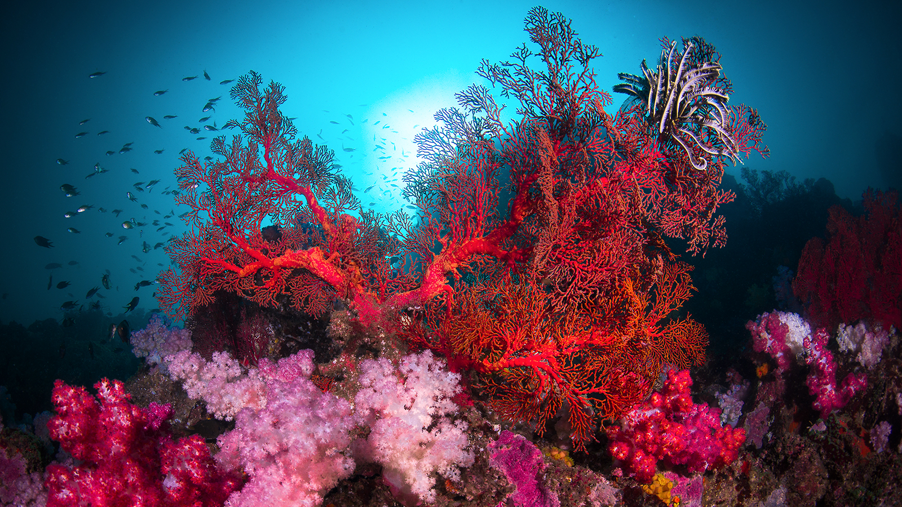
]

---
class: center, middle
#### Estimates

<iframe width="560" height="315" src="https://www.youtube.com/embed/3kb0bz-3lWc" frameborder="0" allow="accelerometer; autoplay; clipboard-write; encrypted-media; gyroscope; picture-in-picture" allowfullscreen></iframe>


---
#### Sources of "Natural Capital"
Food and research value

  - Directly measured from market data- same as with energy resources

Tourism/aesthetic amenity

  - Revealed preference methods (primarily travel cost)

Regulating services

  - Extrapolated from the cost of achieving the same results with man-made structures

  - OR from estimated damage reduction from extreme weather events

Maintenance of genetic diversity

  - Stated preference methods


---
### Case study #2: Bees

Domesticated beekeeping is a textbook example of a positive externality

  - The more honey I produce, the more my neighbor’s crops improve

Pollination services are also sold directly - revenue of ~$656 million per year

https://www.vox.com/2015/7/6/8900605/bees-pollination-ecosystem-services

---
#### Wild bees

Direct value added from crop pollination is ~$15 billion per year in the US

  - (Crop revenue with pollination)  minus  (Crop revenue without pollination)

Pollination also has non-market sources of value

  - Supports genetic diversity, ecosystem resilience, and nutrient cycling

Apparently only 12.6% of wild bees actively pollinate agricultural crops

  - The rest pollinate other plants which are not sold in markets

Valuation based only on marketable crops is easier, but ultimately an incomplete picture of the value

https://obamawhitehouse.archives.gov/blog/2015/05/19/announcing-new-steps-promote-pollinator-health


---
#### Wild bees
Ecosystem services for non-market plants are harder to evaluate

Option value

  - Species that currently do not provide market value could be insurance against pollination losses from climate change

  - Challenging to predict exact value, many variables at play

Non-use value 

  - Support native plant species, ecosystem resilience, and biodiversity


---
#### Colony collapse disorder

~33% of colonies died in the winter of 2010

CGE models estimate that the decline in pollinator services amounts to a $334 billion annual economic loss globally 

  - Most of the loss is not from crops but rather in secondary markets

Shortage of worker bees within a bee community causes hive imbalance

  - Cause is uncertain, but human activity is a likely contributor

White House policy in 2015

  - Aim to set aside 7 million acres of pollinator-friendly habitat

  - However, did little to prevent harmful pesticide use


---
## Reading for next time

- Video: [The economic, social and icon value of the Great Barrier Reef](https://www.youtube.com/watch?v=b3iJ2X9Vjnw)

- [What Is The Real Value Of The Great Barrier Reef?](../Articles/What Is The Real Value Of The Great Barrier Reef | HuffPost) ([online version](https://www.huffpost.com/entry/what-is-the-real-value-of-the-great-barrier-reef_b_595cbea4e4b0326c0a8d13c7))

- [What bees can teach us about the real value of protecting nature](../Articles/What bees can teach us about the real value of protecting nature - Vox.pdf) ([online version](https://www.vox.com/2015/7/6/8900605/bees-pollination-ecosystem-services)).


---
class: clear, middle
# Lecture 31

  - Bioeconomic systems

  - Static fisheries

---
### Recap

Early in this class we studied the two-period model of mineral extraction

  - Scarcity

  - Optimal conservation of resource

  - Role of technology, extraction costs, demand

Value of the conserved resource falls to zero in the long run

  - Use economic models to find the best resource allocation


---
## Bioeconomic systems
Value, quantity, and quality of the resource affects economic activity, and vice versa

  - Fisheries, livestock, forestry

  - Sustainability

  - Inputs and outputs

Contrast with energy resources and non-renewable resources

Bioeconomic systems are more like a bank account


---
## Fisheries

Fishery is the broad term for any bioeconomic fish system

  - Can be private, public, or in between

Biological model - Shaefer (1957)

Assumptions

  - We work with average, long run growth

  - Ignore interaction with other species, population age, other environmental effects

---
### Biological model

.pull-left[

Vertical axis

  - Population change per period

  - Birth/death cycle only, not fishing
]
.pull-right[
Horizontal axis

  - Number of fish presently in the fishery
]


```{r, echo=FALSE, out.width="80%", fig.align='center'}
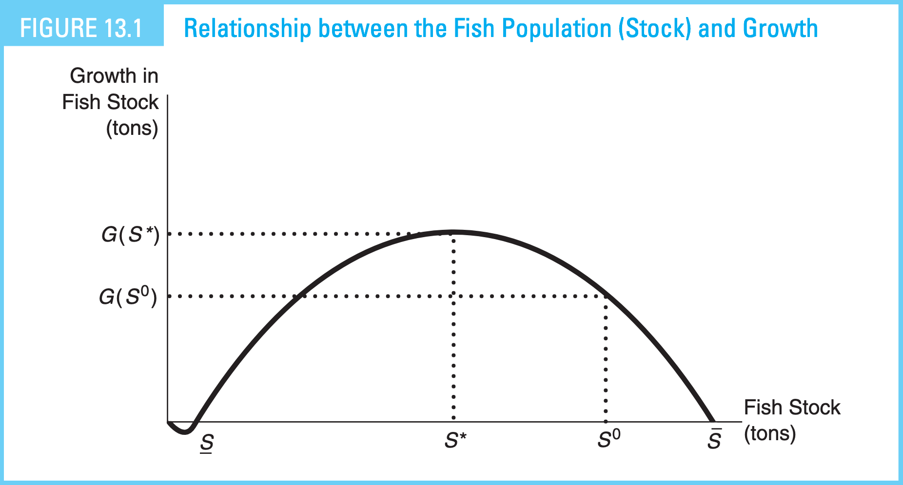
```


---
### Biological model

$\underline{S}$ is not zero; it is the point at which the death rate > birth rate

$\bar{S}$ on the far right is the carrying capacity
  - Resources of the fishery limit population growth
  
```{r, echo=FALSE, out.width="80%", fig.align='center'}

```

  

---
### Biological model

$S^*$ is the "Maximum sustainable yield"
  - Population level that enables the fastest growth rate
  
  - $G(S^*)$ is that rate

We can take $G(S^*)$ per period if the population is at $S^*$, and it will be sustainable

```{r, echo=FALSE, out.width="80%", fig.align='center'}

```


---
### Bioeconomic model
Sustainable (in this context): we face an identical situation every period 

The biological model is the basis for sustainability

  - We can sustainably fish at a rate less than or equal to the growth rate 

  - Licenses in public fisheries are based on this principle

However, we need an economic model if we want efficiency also

Efficient sustainable yield

  - Harvest maximizes (total revenue) – (total costs)

---
### Bioeconomic model

Gordon-Schaefer bioeconomic model of fisheries

Choice variable is the level of "fishing effort"

Assumptions

  - Constant price of fish, constant marginal cost of effort

  - Quantity caught is proportional to stock

  - Discount rate of r=0%

Remember, maximum sustainable yield (MSY) gives us the maximum benefit, not the maximum NET benefit

---
### Bioeconomic model

For now, this is the static model because r = 0%

  - Only looking at sustainable outcomes

  - Level of effort is constrained to be identical in every period

Level of effort $\to$ fish stock $\to$ growth rate

  - Growth rate = number of fish we can take each period

The dynamic model lets us change effort levels over time 

  - According to a non-zero discount rate


---
### Bioeconomic model

Benefit curve is the mirror image of the growth curve from before

  - Large effort $\to$ small population $\to$ low growth rate

  - Small effort $\to$ large population $\to$ low growth rate

  - Medium effort $\to$ medium population $\to$ high growth rate
  
  
```{r, echo=FALSE, out.width="60%", fig.align='center'}
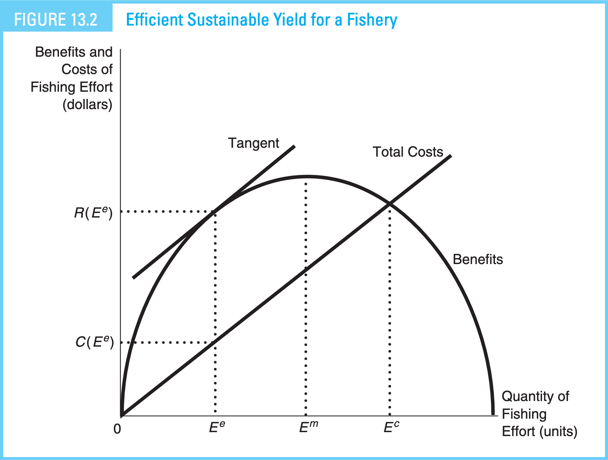
```


---
### Bioeconomic model
Total cost curve

  - Constant MC of effort $\to$ increasing total cost of effort

  - Marginal cost = slope of the Total cost curve (think about it)


```{r, echo=FALSE, out.width="60%", fig.align='center'}

```


---
### Bioeconomic model

At the effort level $E^C$, the total cost of effort is equal to the total benefit

  - Zero profit

At $E^M$, the level of effort results in maximum benefits per period

  - Not maximum profit
  
  
```{r, echo=FALSE, out.width="60%", fig.align='center'}

```


---
### Bioeconomic model
$E^E$ is the effort level corresponding to the "Efficient Sustainable Yield"

$R(E^E)$ is the value of the ESY

$C(E^E)$ is the cost of obtaining the ESY


```{r, echo=FALSE, out.width="60%", fig.align='center'}

```


---
### Bioeconomic model
$R(E^E)$ - $C(E^E)$ is the profit we get when the fishing rate = the ESY

Why is the maximum profit? Two ways to think about it:

1. Max distance (vertical) between TB and TC

2. Point at which MB = MC (slope of TB = slope of TC)


---
## Reading for next time
  
- First half of chapter 13 (Until you get to the dynamic fisheries model)


---
class: clear, middle
# Lecture 32
  - Dynamic fisheries

  - Open access fisheries

---
### Conclusions/Recap

Sustainable fishing $\to$ actions lead to constant population size at the end of each period

Biological model gives us MSY, which maximizes benefits across all sustainable levels of fishing

Bioeconomic model gives us ESY, which maximizes net benefits across all sustainable levels of fishing effort
  - MSY is not efficient because it does not consider any costs

---
### Dynamic model

The dynamic model expands on the static model

  - Allows for non-sustainable outcomes that may be more efficient if we explicitly value the present over the future

  - Discount rate of zero turns this back into the static model

The dynamic fisheries model includes the other two

  - For this section, let’s focus on how model assumptions change the conclusions

Disclaimer: the math in this section of the book uses differential equations, but it does not actually acknowledge this


---
### Open access fisheries

Everything before now has been from the perspective of a single decision-maker who captures the benefit of conservation

  - Think of inland fish farms or privately owned lakes

How do things change when we introduce other people to the mix?

  - Most fisheries are open-access; common resources

  - Oceans, coastlines, rivers, lakes

When we treat fish as a rival but non-excludable good, there are two main sources of inefficiency


---
#### Static inefficiency

In the static ESY scenario, fish profitably in every period

  - Under open access, profit opportunity brings additional entrants

More participants $\to$ higher total effort $\to$ smaller stock of fish

  - Even under sustainable fishing levels, this is inefficient

Principles of micro- perfectly competitive markets

  - In the long run, more competitors will enter until industry profit goes to zero

  - We can apply this logic to open access fisheries


---
#### Static inefficiency

Recall from before, $E^E$ is the level of effort corresponding to the ESY

With open access, participants enter until there is no more profit opportunity, and total effort is at $E^C$

  - In this picture, they have about the same sustainable catch, but costs are much higher under open access


```{r, echo=FALSE, out.width="60%", fig.align='center'}

```


---
#### Dynamic inefficiency
In open access fisheries, individual decision-makers do not benefit as much from leaving fish in the water

  - All of the incentives of the dynamic model plus a lower benefit in the future

This often leads to overfishing

  - Textbook example of tragedy of the commons

---
## Reading for next time

- Chapter 12, pages 293-299


---
class: clear, middle
# Lecture 33

  - Forestry

---
### Forests

Forests cover 33% of the land in the US, about 31% globally

Bioeconomic system
  - Value of the resource over time depends on economic interaction

Forests are open-access, but usually not as open as fisheries

  - Probably easier to regulate logging companies and farms than individuals who fish

Age

  - Key feature for fisheries model- growth rate of the population

  - Key feature for forest model- growth rate of individual trees


---
### Deforestation

Biggest cause of deforestation is land use conversion

  - Clearing forest land for agricultural and livestock land

  - Subsistence farming is a big part of this- is afforestation/reforestation regressive?

Aggravates the problem of climate change through lowered GHG sequestration capacity

  - Afforestation/reforestation has a positive externality 🡪 under-produced common resource

Loss of ecosystem services

  - Biodiversity, soil erosion and desertification 

  - Coastal protection- mangrove swamps


---
#### Deforestation/Afforestation

.left-column[
Green: forest cover

Red: loss (2000-2016)

Blue: gain (2000-2012)

Purple: gain and loss
]
.right-column[
.center[

```{r, echo=FALSE, out.width="60%", fig.align='center'}
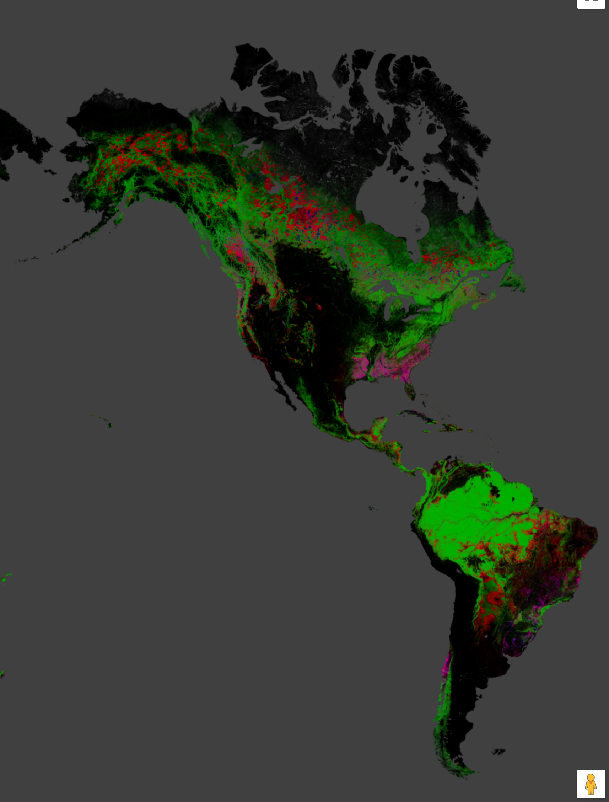
```

[Source](https://earthenginepartners.appspot.com/science-2013-global-forest)
]
]

---
class: center, middle

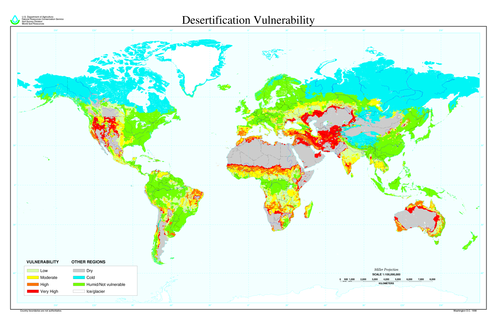


---
class: center, middle 

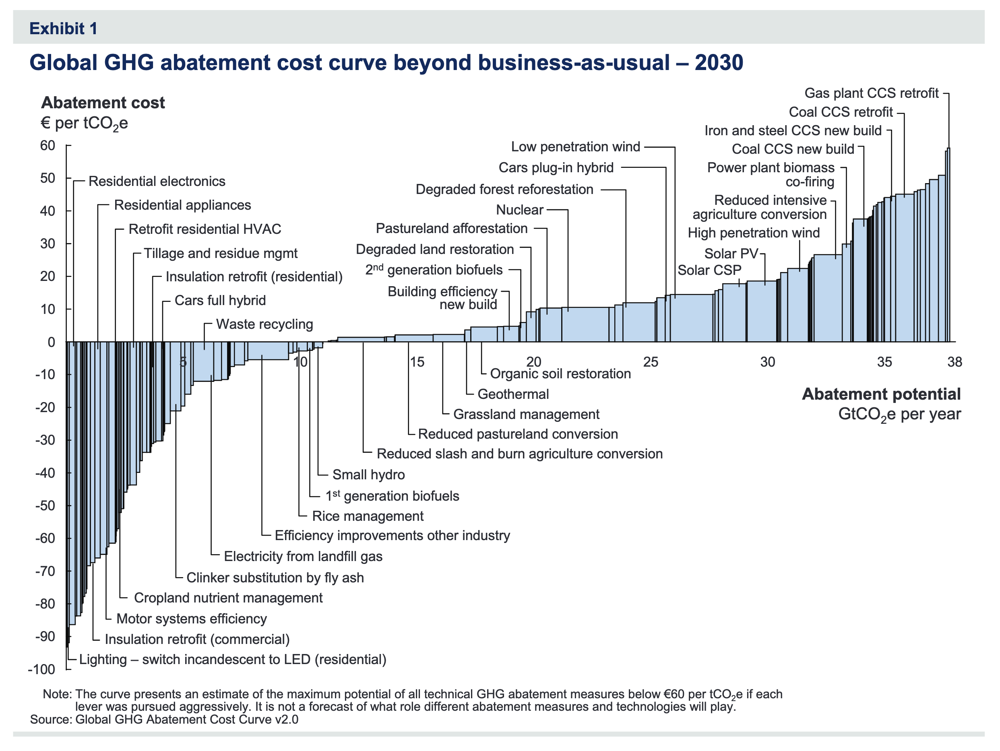

[Source](https://www.mckinsey.com/business-functions/sustainability-and-resource-productivity/our-insights/pathways-to-a-low-carbon-economy)


---
### Harvest of forests

Macro perspective- land use management
  - Different land uses have different value to society, optimal balance (next class)

  - Problems related to open access and tragedy of the commons

Micro perspective- optimal timing of harvest decision
  - Today: model of plantation forestry

  - Single owner, profit maximization problem

Commercial uses of forest harvest

  - Wood fuel, building material, paper products, etc.


---
### Comparison with fisheries

Both resources: slower growth rate or higher discount rate incentivizes overuse
  - When r > g, it may be efficient to deplete the resource

Compared to fisheries, forests:
  - Grow more slowly but last longer

  - Have more well-defined property rights

  - Are a crucial input into climate change models


---
### Biological model of growth (Clawson, 1977)

.pull-left[
Growth is in volume of wood per acre, per year
  - Average growth rate of all trees in the plantation

Trees do not affect growth rate of other trees

Number of trees does not change
]
.pull-right[
	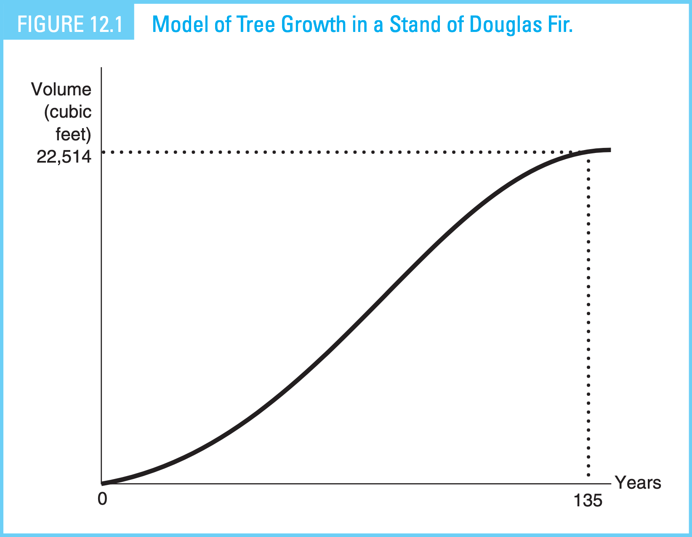
]


---
### Single-rotation harvest model

Single-rotation
  - No re-planting decision; model ends at harvest

Assumptions
  - Fixed cost of planting one acre: $1,000

  - Marginal cost of harvesting: $0.30 per cubic foot
  
  - Price: $1 per cubic foot

Maximize PV(NB)

  - PV(NB) = PV(revenue) – PV(extraction cost) – planting cost in period zero


---
### Economic Harvesting Decision

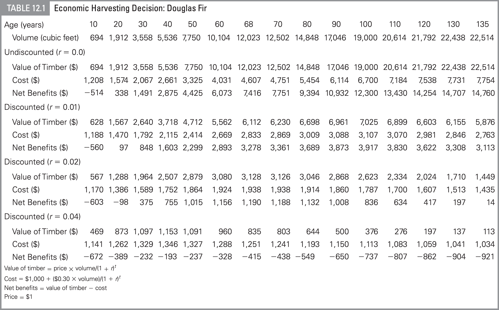


---
### Main ideas

Planting costs happen in current period, no discount
  - Benefits and marginal cost of harvest occur in the future and they are discounted equally

Higher discount rate $\to$ harvest sooner

Cost and price do not affect optimal harvest date
  - Cost and price affect overall profitability
  
  - "I wish I hadn’t made this investment, but I still benefit from harvesting it"


---
### Multiple-rotation harvest model
Multiple-rotation harvest creates interdependence
  - Harvest early and invest the earnings vs harvest later and increase forest value

  - Invested earnings help pay for next cycle

The punchline: later harvest dates have an additional opportunity cost compared to the single-harvest model
  - Ability to re-plant results in shorter optimal harvest cycles


---
#### Complicating the model

Relaxing assumptions
  - Lumber prices tend to increase over time (graph)
  
  - Harvest technology improves over time, leading to lower MC

These effects lengthen the optimal harvest cycle, as the net benefit per unit grows over time
  - Counteracts the discount rate


---
## Reading for next time
Land use
Chapter 10


---
class: clear, middle
# Lecture 34

  - Land use

  - Food insecurity


---
## Land resources

Fixed location, multi-purpose resource

Land is inherently scarce because we cannot make more of it
  - Allocation problem is in choosing between competing uses of land

Unrestricted markets tend to allocate land according to its highest value use
  - Value determined by willingness to pay rather than net social benefits


---
### Urban planning model

.pull-left[
Each line is called a "bid-rent" function
  - Net benefit of each activity depends on how far away it is from the city center

  - E.g. increasing travel costs to economic center

Everything from zero to A miles from the city center should be residential
]
.pull-right[
	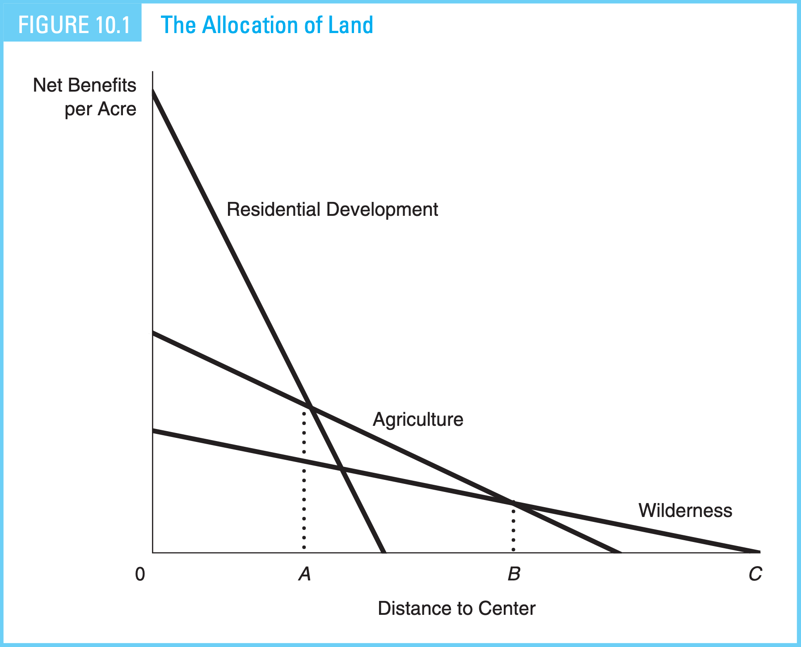
]

---
### Urban planning model

.pull-left[
In practice, subsidies and development negotiations make it hard to define points A and B

Wilderness area is a public good (with positive externalities) so usually WTP < social value
  - $\to$ Deforestation
]
.pull-right[
	
]

---
### Land use conversion

Over time, these relationships can change with technology
  - 1870: 50% of US population worked in agriculture

  - 2008: <2% of US population worked in agriculture

In the US
  - Industrialization shifted bid rent function upward for urban uses

  - Rising productivity of agricultural land, improved shipping infrastructure shifted bid rent function down for agriculture

  - Entire regions specialize in agriculture or in non-agriculture

---
### Inefficient allocation of land

Urban sprawl/ leapfrogging
  - Inefficient spacing of land use

  - Development expands too far outward, disconnecting vacant land from the wilderness outside of a city

Incompatible land use
  - Airports near neighborhoods, etc.
  
  - Bilateral externality across nearby geographic regions

Market power
  - Land has no substitutes, can lead to price markups

  - Can increase the cost of preserving public land, or reallocating land more generally


---
#### Some solutions
Zoning laws
  - Group compatible land uses together

  - Minimize/internalize the negative externalities

Eminent domain
  - Government seizes land and pays "just compensation"

Demand for residential development around valuable areas (Boulder) rises, and can sometimes overcome good judgment about land use
  - Denser is usually better!


---
### Food insecurity
Most environmental issues are relatively new, but this one is old

WHO/FAO pillars of food insecurity
  - Availability, accessibility, utilization, stability

Early economist Thomas Malthus (~1800)
  - Argued there is an unsustainable relationship between growth of human population and growth of food production

This type of argument persists today, but we easily create enough food for everyone
  - Technology outpaces human population growth


---
### Food production
Modern food insecurity is more about costs and  distribution across people, not total production
  - Current food production capacity is essentially unlimited

Vertical Indoor Farming
  - Vertical farming can reduce carbon footprint by reducing need for transportation
  
  - Lower water use, much greater yield efficiency, conditions determined by machine learning algorithms


---
### Global food market

.pull-left[
Supply curve for the global food market is still up for debate

$S_a$ : Elastic supply

$S_b$ : Inelastic supply

$D_1 - D_6$
  - Demand curves shift with population growth over time
]
.pull-right[
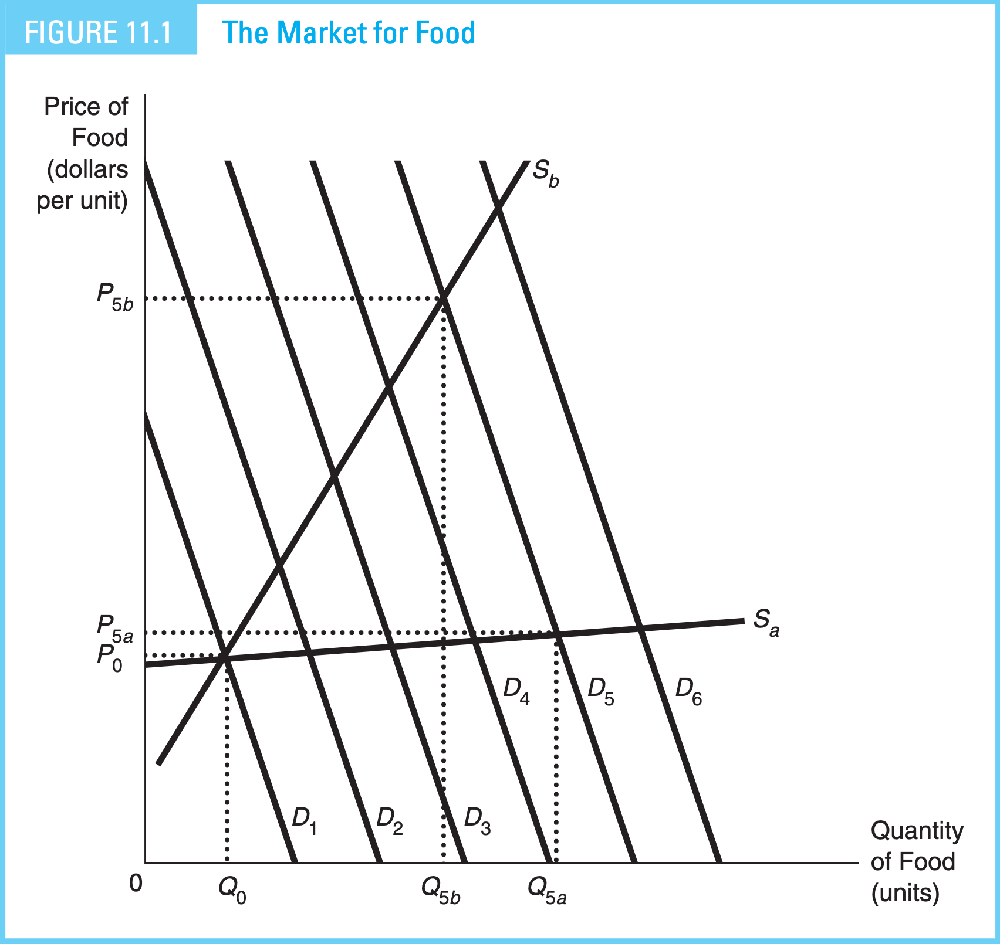
]


---
### Global scarcity hypothesis

.pull-left[
Strong form: per capita food production is declining
  - $\to$ Steep curve like $S_b$

  - Little empirical evidence in recent past

Weak form: food prices are rising faster than other prices
  - $\to$ Not as steep as $S_b$ but upward sloping
  
  - A reasonable hypothesis
]
.pull-right[

]


---
## Next time

- Water (Chapter 9)


---
class: clear, middle
# Lecture 35
- Water

---
## Water demand

.pull-left[
US: 355 billion gallons per day (2010)
  - Lower than in 2005

Thermoelectric power requires a lot of water for cooling

Agriculture too
  - Doesn’t include livestock

Public supply
  - Residential and commercial uses
]
.pull-right[
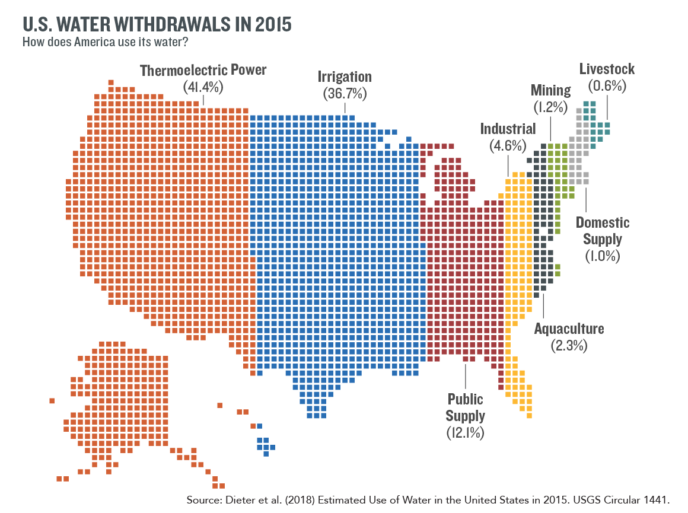	
]

---
### Water demand
Residential/commercial (~12% of total)
  - Water is a utility good much like electricity
  
  - Homes are connected for direct water use (showers, tap, sprinklers) and for waste (toilets, sink drains)


---
### Residential water pricing
.pull-left[
Compared to electricity, water demand is more elastic
  - Easier on the margin to conserve water than electricity (when prices are high)

  - However, demand response is harder

Ex. 9.5
  - Canadian households with water metering are better at conserving water

  - Water use was 70% higher under flat rate than under inverted block rate
]
.pull-right[
	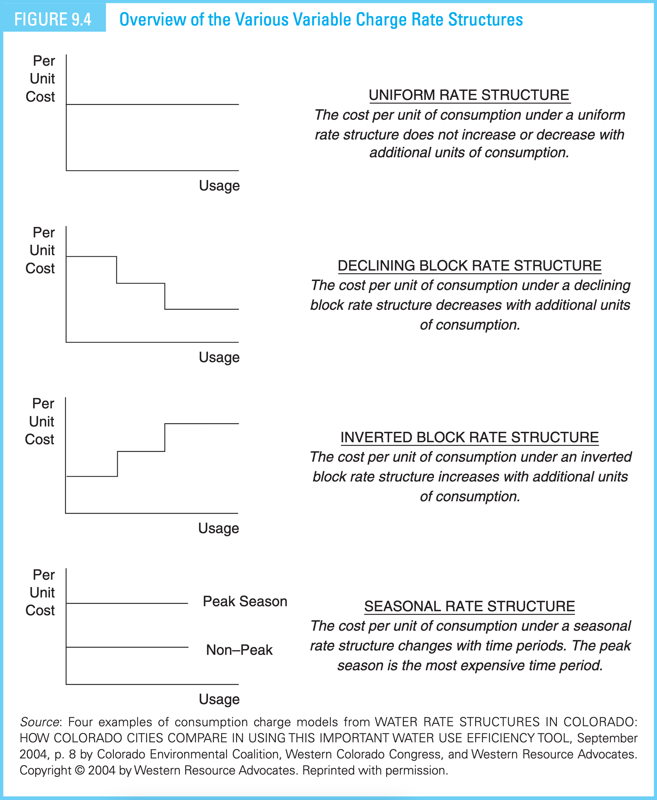
]

---
class: center, middle
### Water demand

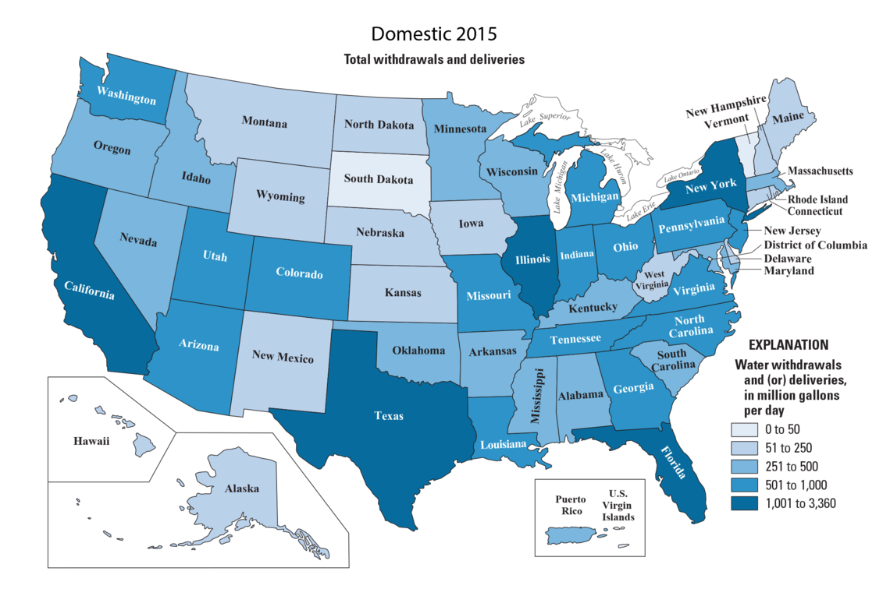


---
### Water supply
Fresh water is plentiful overall, but it is scarce in some places
  - No universal rules for water management

Surface water: renewable

Ground water in aquifers: semi-renewable

---
#### Example: Ogallala Aquifer

.pull-left[
Huge aquifer in the middle of the US
  - Ground water

Supplies water primarily for agriculture

Annual refill rate: 22mm per year; Extraction rate: 77mm per year
]
.pull-right[
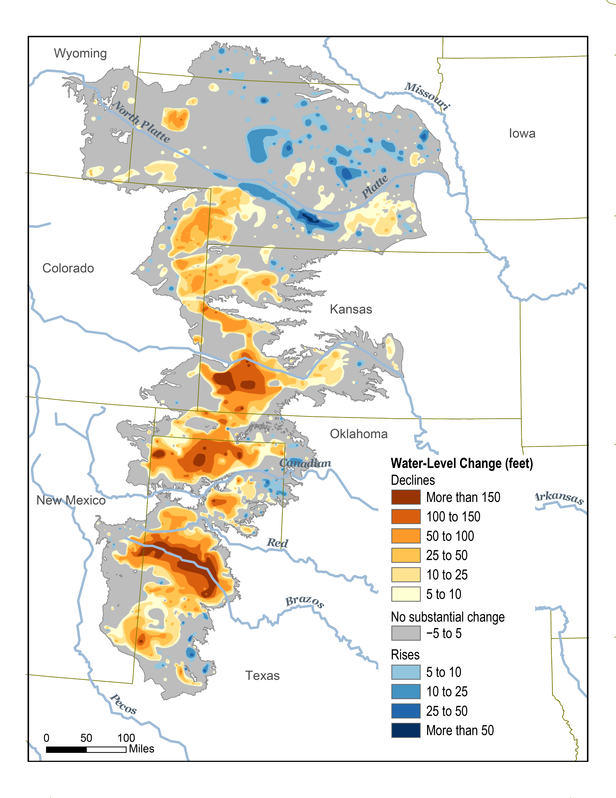
]


---
### Water rights
Water rights are particularly challenging to assign

  - Water is used and then disperses; cannot own specific water molecules

  - Sources of water change dramatically over time

  - Changes to water infrastructure can affect existing beneficiaries

Riparian rights

  - Early American system gave water rights to owners of adjacent land

  - Became less appropriate as population growth and development created scarcity


---
### Water rights
Under the structure of riparian rights, there was no way to transfer ownership

  - Transferability- one of the necessary components for complete property rights

  - It became necessary to revise the rules when water became important elsewhere

Prior appropriation doctrine

  - No longer tied to land ownership

  - Whoever starts using the water first gets "senior" rights

  - "Junior" rights distributed to the next group


---
### Water rights

Over time, perspectives evolved until water was seen as a public good

  - Owned by the state, used by citizens

Instead of a right to ownership of water, people could have "usufructuary rights" 

  - Allowed them access to the public good without traditional ownership rights

  - Government ultimately claimed ownership/responsibility

Expanded role of federal government in water allocation

---
### Privatization of water
Facing declining infrastructure, government can turn over control to private companies

  - Hoping they can manage water more efficiently

  - Attractive option for poorly funded governments

Cochabamba, Bolivia

  - Privatization can go very badly- violent protest and early contract termination

  - Monopoly control over an essential resource, price hikes

  - Movie- Tambien la Lluvia (Even the Rain) 


---
### Surface water
Because surface water is renewable, allocation problem is across different uses within the same time period

---
#### Texas rice belt
Since around 1900, farmers in the lower floodplains of the Colorado River received water naturally

Over time, population increased dramatically
  - Water authority built dams to form reservoirs and supply residential water

Rice farmers received water for a very low price because of their rights
  - More socially efficient to let the price rise, force farmers to switch crops

  - Issue of efficient land use conversion over time

Recent droughts put stress on the region


---
## Reading for Next Time

- [Is Recycling Worth It?](../Articles/Is Recycling Worth It - Scientific American.pdf) ([online version](https://www.scientificamerican.com/article/is-recycling-worth-it/)).


---
class: clear, middle
# Lecture 36
- Waste and Recycling

---
## Overview

Virgin vs recycled materials 
  - How do firms choose the type of inputs to use?

Trash can vs recycling bin
  - How do consumers choose where to put their waste?

Total volume of trash produced
  - How does society decide what trash is worthwhile?

---
## Overview
The US generates about 254 million tons of trash per year
  - Recycle or compost about 87 million tons (34.3%)

Landfills produce about 1.8% of the greenhouse gases in the US
  - Mostly methane, which is a bad one

Connection to resource taxonomy concept
  - Resources exist in several forms- in the ground, in landfills, and in existing products distributed throughout the economy

  - Each of these enter into the "potential reserves" function- they are profitable to extract under some set of circumstances [Is Recycling Worth It?](https://www.scientificamerican.com/article/is-recycling-worth-it/)


---
## Economics of recycled materials
The value of recycled materials depends on both economic and environmental factors
  - Varies according to the material, as well as economic conditions

Direct: Price of recycled material vs price of virgin material
  - All else equal, profit-maximizing firms will probably choose the cheaper of the two

Indirect: Net externality of recycling vs net externality of disposal
  - If this difference is important, there may be a market failure


---
### Cost of recycling
Labor costs
  - Sorting, handling, resource marketing, certifications

Transportation
  - Usually requires additional steps

Energy use
  - Some of the benefit is negated by the extra energy used in the process


---
### Disposal options
Landfill/dump
  - Aesthetic externality if located near population; extra energy/transportation-related externalities if not

  - Methane emissions from decomposition- potential for energy conversion?
  - Potentially useful resources are harder to obtain in the future

Incineration
  - Essentially recycling the energy potential, but usually with low efficiency

  - Emissions are hazardous- fly ash and heavy metals


---
### Consumer recycling decision

The consumer’s choice between bins determines the recycling rate
  - On the other hand, the firm’s perspective takes recycling rate as a given

Consumers mostly care about the net external impact of recycling
  - Otherwise it’s just a transfer from mining company shareholders to recycling company shareholders

It’s an abstract decision with no direct feedback 

  - Is ____ worth recycling if I have to thoroughly clean it first? 

  - Are they just going to toss it in the landfill if I don’t do a good enough job?

The "warm glow" effect and other social norms play a huge part in this decision


---
### What should we recycle?
Some materials are worth it
  - Aluminum - energy use 96% less than virgin aluminum

  - Paper products also usually have significant net benefit

However, others are often not worth it
  - Glass is often a net negative to recycle

> "Our biggest concern and our biggest challenge today is municipal solid waste and contamination in our inbound stream…roughly 15 to 20 percent of what we process ends up going back to the landfill. It’s incredibly inefficient to do that."
> 
> CEO of ReCommunity Recycling


---
#### Waste Reduction Model (WARM)
EPA created WARM to evaluate GHG reduction methods

Biggest sources of GHG that could be reduced via better methods


---
#### Policies

Volume pricing of trash
  - Parallel to "demand response" idea in electricity- incentives are better when there is a decision to be made on the margin

Influences two different decisions
1. which bin to use?

2. how much trash to produce overall?

Downsides
  - Illegal dumping of trash to save money

  - Regressive?

---
#### Policies

Refundable deposits for recyclable goods
  - E.g. bottles, cans, batteries, pesticide containers

Works like a conditional tax - only have to pay it if you don’t end up recycling

Probably more progressive than regressive


---
#### Policies

Taxing the non-recyclable version of a good, i.e. plastic bag taxes
  - Probably motivated by littering, which is related

Ireland imposed a 0.15 euro tax on plastic bags
  - $\to$ 90% decrease in use

Evidence suggests that wealthier customers tend to change their behavior, whereas poorer customers mostly absorb the tax
  - Almost certainly regressive on the cost side

  - Who benefits from reduced litter?
